# Research Pilot

**A desktop workspace for doing research with Claude Code, Codex, or the built-in PI Agent.**

Work on papers, code, experiments, and presentations in one project folder. Keep the papers you found, the decisions you made, and the evidence behind your results available when the conversation ends.

[Download 0.7.0](https://github.com/daidong/DIR-Agent/releases/tag/v0.7.0) · [Release notes](https://github.com/daidong/DIR-Agent/releases/tag/v0.7.0) · [Report a problem](https://github.com/daidong/DIR-Agent/issues)

## What you can do

| You want to… | Start here | What stays available |
| --- | --- | --- |
| Read papers and compare evidence | Ask an agent; browse **Literature** and **Knowledge** | Saved papers, source links, Wiki pages and notes |
| Write, code, or prepare slides | Open a project and use **Claude**, **Codex**, or **PIAgent** | Project files and session history |
| Explore a research question over several steps | Create a plan in **Research**, revise it, then approve it | Plan versions, attempts, evidence, decisions and reports |
| Continue a project next week | Reopen its workspace | Project memory and prior work, according to the selected mode |
| Follow work away from your desk | Pair the optional phone companion | The same computer-hosted sessions and research views |

For example, ask: “Compare the methods in these three papers, find the strongest objection to my proposed experiment, and save a short plan with sources.” You can inspect the papers in Literature, revise the plan with the agent, and keep the resulting document in your project.

## Start in a few minutes

1. **Install Research Pilot** using the package for your computer below.
2. **Choose an agent.** For Claude or Codex, install that CLI and sign in from a terminal. For PI Agent, configure a model and authentication in **Settings → PI Agent**; its runtime is bundled.
3. **Open a project folder.** It can be an existing repository or an empty research folder.
4. **Run Settings → Environment check**, then open the agent tab and send a small request.

Try: “Explain this project and the research material already saved for it. Suggest one useful next step.”

| Computer | Recommended package | Alternative |
| --- | --- | --- |
| macOS · Apple Silicon | [DMG](https://github.com/daidong/DIR-Agent/releases/download/v0.7.0/Research-Pilot-0.7.0-mac-arm64.dmg) | [ZIP](https://github.com/daidong/DIR-Agent/releases/download/v0.7.0/Research-Pilot-0.7.0-mac-arm64.zip) |
| Ubuntu/Debian · Intel / AMD 64-bit | [deb](https://github.com/daidong/DIR-Agent/releases/download/v0.7.0/Research-Pilot-0.7.0-linux-amd64.deb) | [AppImage](https://github.com/daidong/DIR-Agent/releases/download/v0.7.0/Research-Pilot-0.7.0-linux-x86_64.AppImage) |
| Ubuntu/Debian · ARM 64-bit | [deb](https://github.com/daidong/DIR-Agent/releases/download/v0.7.0/Research-Pilot-0.7.0-linux-arm64.deb) | [AppImage](https://github.com/daidong/DIR-Agent/releases/download/v0.7.0/Research-Pilot-0.7.0-linux-arm64.AppImage) |

On macOS, open the DMG and drag Research Pilot into Applications. On Ubuntu/Debian, install the downloaded deb with `sudo apt install ./Research-Pilot-0.7.0-linux-amd64.deb` (use the arm64 filename on ARM).

The app includes its runtime and data service. Packaged use does not need Node.js, Docker, a source checkout, or a manually started server. Windows and Intel Mac installers are not included. Choose a named application package; GitHub's automatic “Source code” archives are the public repository snapshot, not the application.

[Detailed installation and setup](docs/installation.md) covers CLI login, AppImage dependencies, optional tools, API keys, upgrades and troubleshooting.

## Choose how to work

**The agent is the execution engine.** Claude and Codex run their installed CLIs inside the app. PI Agent runs in a separate bundled process and supports configured model providers and compatible local endpoints. Their available tools and authentication differ; the app does not make them interchangeable.

**The work mode sets the session's defaults.** Use the workspace mode picker for Collaborator and enable the experimental choices to explore Ideator, Builder, Teacher, or Policy & Records. These emphasize general collaboration, exploring ideas, engineering, teaching, or source-based policy and record work. You can inspect a mode or create a custom one. A mode is a starting style and configuration, not proof of better answers or a security sandbox.

Changing modes can end the workspace's ordinary foreground sessions. The app shows the affected sessions before you confirm and starts fresh sessions with the new configuration. Saving a custom mode and applying it are separate actions. Changing PI's model or reasoning effort is a separate choice; its workspace selection is restored after an app restart.

## Papers, knowledge, and memory

These serve different purposes:

| Information | What it is for | Scope |
| --- | --- | --- |
| **Paper Wiki** | Source-backed summaries and connections you can revisit | Shared across projects |
| **Saved papers and notes** | The material a particular project relies on | Associated with the workspace |
| **Project memory** | Decisions, constraints and context worth carrying forward | Loaded according to the work mode and launch settings |
| **Conversation history** | What happened in a session | Available for review and continuation |

The research workflow starts with existing knowledge, searches for gaps, reads original sources for exact claims, and saves useful material. Literature search supports academic indexes; general web search in PI uses a separately configured Brave key. Full-text access depends on the paper and configured sources.

Memory keeps source and time relationships. A later decision can replace an earlier one without turning every wording difference into a conflict. Memory can be disabled for a launch or by the selected mode. Saved notes and model summaries still need checking against original evidence when accuracy matters.

## From a question to a research run

A Research run is a recorded investigation with a reviewed plan and a model-cost limit. Use ordinary chat for quick work; use the **Research** page when you want the system to retain the plan, attempts, reviews and results together.

1. Enter your question and optional background in **Research**. Choose a model, cost limit and execution permissions.
2. Generate a plan, read its intended work and completion criteria, and request changes in the same page.
3. Select **Approve & start** for the reviewed version. Generating or editing a plan does not start the investigation.
4. Follow progress, inspect design proposals and evidence, and intervene when a decision needs your input.

New runs can compare independent design proposals, critique them, select a direction and refine it before execution. They can also refine an already chosen direction directly. The application records these steps and their dependencies; this does not establish that a proposal is novel or scientifically sound.

Drafts and plan history are saved. If you quit during plan generation, the saved draft remains and generation can be retried. The displayed run budget covers model usage after launch; it excludes planning calls and external machines or services. Approved execution permissions still determine what a run may do.

## Longer PI sessions

PI Agent now checks the input sent to the model, keeps large tool results in local storage, and retrieves their original text when needed. Older conversation can be compressed while the complete session history remains available. The interface shows when this is happening.

Version 0.7 moves Codex subscription compaction later and gives Anthropic sessions a working-context ceiling. The smaller Codex output reserve is an input-budget calculation, not a new response-length setting. Provider limits still apply. Changing providers can require rebuilding the model's working context.

## Use your phone

The optional companion lets you follow and drive Claude, Codex and PI sessions, browse project material, and change work mode from phone Settings. Your computer must stay running.

Install and connect Tailscale on both devices, then enable **Settings → Phone (iOS companion)** on the desktop and pair using its QR code. HTTPS is needed for the supported iOS Home Screen and notification setup. The pairing link grants access to sessions and agent controls; keep it private.

[Phone setup and access controls](docs/installation.md#7-optional-follow-and-drive-sessions-from-your-phone).

## Permissions and your data

Desktop and phone sessions launch Claude Code with `--dangerously-skip-permissions` and Codex with `--dangerously-bypass-approvals-and-sandbox`. Agents can run commands, edit or delete files, and use the network with your OS account's permissions without per-action approval. Codex's own sandbox is disabled. This fixed launch behavior does not grant administrator privileges. Use trusted tasks and keep backups.

Research data lives under `~/.pipilot` by default. Your documents and code stay in the project folders you choose. Opening a workspace can synchronize integration files under `.agents`, `.claude` and `.pipilot`, plus managed guidance in `AGENTS.md` or `CLAUDE.md`.

Local storage does not mean offline processing: model providers, search services and other configured tools receive the requests needed for their work. Credentials, account access and provider charges are configured separately.

Before upgrading, finish active work and quit the app. Replace the application, then reopen it so both the app and bundled services use the new version. Keep a backup of `~/.pipilot` and your project folders; do not delete research data as an upgrade step.

## Help and release checks

- [Installation, configuration and troubleshooting](docs/installation.md)
- [What changed and what was tested in 0.7.0](https://github.com/daidong/DIR-Agent/releases/tag/v0.7.0)
- [Issues](https://github.com/daidong/DIR-Agent/issues) — include app version, OS, CPU, package type and reproduction steps. Remove credentials and private research from diagnostics before sharing.

This public repository hosts application packages, documentation and community issues. The application source is maintained separately.
